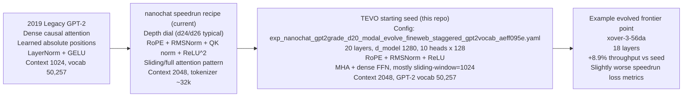
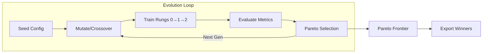
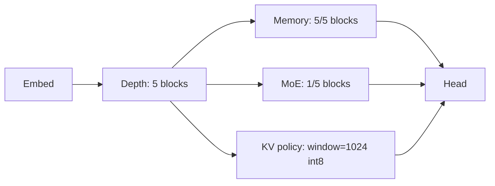
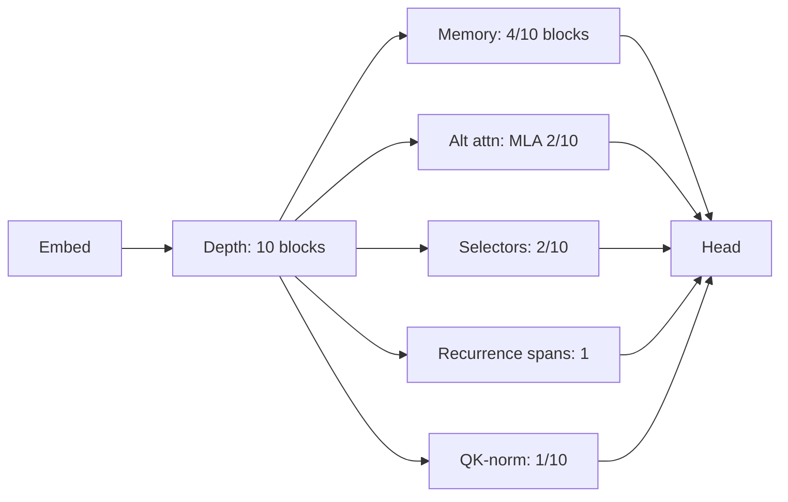
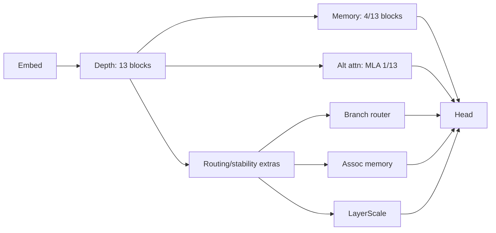

# Transformer Evolution LLM
[](https://deepwiki.com/strangeloopcanon/transformer-evolution-llm)

An evolutionary architecture-search loop for Transformer-like language models.

Architectures are defined in typed YAML (Pydantic). The loop mutates/crosses over these specs, trains each candidate for a short budget, scores it on multiple objectives, and keeps a Pareto frontier. To keep the search practical, children can inherit weights from parents and crossover merges checkpoints when possible.

## Punchline (Emergent Behavioral Motifs)

Purely behavioral selection (loss + memory/speed + novelty/entropy) repeatedly discovers *embedding-conditioned FFNs* (FFNs that read token embeddings instead of the residual stream). This trait was not an explicit objective.

Example (Modal A10G, 64 generations, vanilla 4-layer seed; short-budget proxies):
- best `ppl_code`: `1331 -> 791`
- `long_recall`: `0.0 -> 1.175`
- `kv_bytes_per_token`: `8192 -> 7168`

Motif: early embedding-conditioned FFNs + mixed `MHA/GQA` attention + lightweight memory extras.

Repro:
```bash
TEVO_MODAL_GPU=A10G modal run scripts/modal_run_live.py \
  --config-path configs/exp_behavioral_memory_modal_v1.yaml \
  --generations 64 --steps 160 --eval-batches 4 --seed 0 \
  --download --local-out-dir runs/modal \
  --cleanup-old-checkpoints --prune-checkpoints-to-frontier --lineage
```

## Why This Exists

This repo is a sandbox for answering questions like: “under a fixed training recipe and constraints, what kinds of architectural motifs survive?”

It’s meant to be:
- A way to explore trade-offs (quality vs speed vs memory) without hand-writing dozens of model variants.
- A way to make results inspectable: every run emits a frontier plus lineage describing how candidates were produced.

The goal is to use laptop-scale surrogates (~65–100M params) as a fast feedback loop to discover motifs that can then be scaled up.

## Key Features

- **Typed DSL**: Architectures are defined in YAML/JSON using a strict Pydantic-based schema (`src/transformer_evolution_llm/dsl.py`), ensuring all generated candidates are valid by construction.
- **Embedding-Conditioned FFNs (optional)**: FFNs can read from the residual stream or directly from token embeddings; blocks can optionally include a secondary FFN branch to split capacity.
- **Aligned Crossover + Checkpoint Merge Reports**: Crossover aligns blocks by structural similarity and lineage IDs (`origin_id`/`parent_origin`), then merges checkpoints using that alignment with per-child transfer reports.
- **Archive Novelty + Multi-Objective Optimization**: Maintains a Pareto frontier and can score novelty via archive kNN sparseness (with parent-relative novelty kept as a diagnostic metric).
- **Rich Mutation Primitives (Grow + Shrink)**: Includes additive and simplifying operators (for example `remove_block_span`, `moe_to_dense`, `strip_extras`, `remove_recurrence`, `simplify_attention`) plus component/hyperparameter mutations.
- **Extensible Mutation Registry**: Built-ins, template mutations (`tpl::...`) and runtime plugin mutations can all be registered for autonomous selection and adaptive weighting.
- **Progressive Complexity Schedules**: Optional `gate_schedule` supports generation-based threshold ramps; MAP-Elites can optionally include complexity bands in archive keys.
- **Template Learning (experimental)**: Optionally adjusts and persists mutation templates based on which template mutations improve objectives (`evolution.template_learning`, `evolution.template_learning_save_path`).
- **Graph Module Primitive (experimental)**: A built-in `graph_module` component that can be inserted as a custom extra so search can explore small operator graphs, not just fixed blocks.
- **Audit Lineage**: Every discovery comes with a full lineage payload (`nodes`, mutation traces, crossover reports, novelty archive snapshot) plus visualization tools.
- **NanoGPT-style benchmark path (implemented)**: A repeatable speedrun-style metric (`tokens/time to target`) for comparing training efficiency inside this repo (see `docs/nanogpt_benchmark.md`).

## What You Get From A Run

A run writes a small set of artifacts under `runs/<run_id>/`:
- `frontier.json`: the non-dominated candidates (each has a full `spec` + `metrics` + `id`).
- `lineage.json` / `frontier_lineage.json`: lineage payload with `nodes` (parent links, mutation traces, crossover reports) and novelty archive state.
- `frontier.manifest.json`: the run recipe + environment snapshot.
- `checkpoints/` (optional): model checkpoints (often pruned to frontier-only).

See “Run Folder: What’s What” below for the full list.

## Scope (What This Is / Is Not)

- **Bounded search space:** evolution can only produce what the DSL + mutation set can express. To explore a new primitive (e.g. a new memory operator), you have to add it to the codebase first.
- **Short-budget proxies:** most metrics come from short surrogate training. Expect the frontier to move when you increase data, steps, or change objectives.
- **Not a leaderboard:** the NanoGPT-style benchmark is for repeatable *within-repo* comparisons. The micro-benchmark numbers in this README used a tiny packed OpenWebText subset; regenerate a larger cache before drawing conclusions.
- **Not interpretability tooling:** this repo can discover motifs; it does not (yet) provide mechanistic explanations for why a motif works.

## Search Regimes

So what: the same engine can be run in a "constrained optimization" posture or a more "exploration-heavy" posture purely via config.

- **Constrained optimization (default posture):**
  - Fixed `rung0_thresholds`, stronger quality/efficiency objectives, and selection tuned for stable gains.
  - Best when you want reproducible improvements around a known baseline family.
- **Exploration-heavy posture (config-driven):**
  - Enable `gate_schedule`, novelty-heavy objectives, MAP-Elites complexity banding, and a broader mutation mix.
  - Best when you want multiple structurally distinct families and gradual complexification pressure.

In both regimes, the search space is bounded by the DSL + registered mutations.

<details>
<summary>Extending the search space (adding a new primitive)</summary>

At a high level:

1) Add a typed config to the DSL (`src/transformer_evolution_llm/dsl.py`).
2) Implement the module in the model code (`src/transformer_evolution_llm/models.py`).
3) Add any static checks / cost estimates (`src/transformer_evolution_llm/evaluation.py`).
4) Add a mutation operator so evolution can discover it (`src/transformer_evolution_llm/mutations.py` or `src/transformer_evolution_llm/template_mutation.py`).

</details>

## Architecture Map: Legacy vs Speedrun vs TEVO Seed

So what: these are three different model families. Comparing them directly is useful, but they are not interchangeable baselines.

| Axis | Legacy GPT-2 (2019) | nanochat speedrun recipe (current) | TEVO starting seed (this repo run) | Latest evolved frontier point (`xover-3-56da`) |
|---|---|---|---|---|
| Family | Original GPT-2 | nanochat GPT variant | TEVO DSL seed inspired by speedrun constraints | TEVO child from crossover lineage |
| Core stack | Dense causal attention + LayerNorm + GELU | RoPE + RMSNorm + QK norm + ReLU^2 + sliding/full pattern | RoPE + RMSNorm + ReLU + mostly sliding-window MHA | Same family as seed; no new primitive class added |
| Scale | Larger legacy GPT-2 variants (e.g., XL line) | Depth dial, GPT-2-grade around d24/d26 | d20 seed (`d_model=1280`, `10x128` heads) | d18 (`d_model=1280`, `10x128` heads) |
| Context | 1024 | 2048 | 2048 | 2048 |
| Vocab/tokenizer | GPT-2 tokenizer (`50,257`) | nanochat tokenizer (`~32k`) | GPT-2 tokenizer (`50,257`) | GPT-2 tokenizer (`50,257`) |
| Attention density | Fully dense | Mixed sliding/full by pattern | Mostly sliding-window (`1024`) with some full layers | Similar pattern, but one fewer sparse layer (`15 -> 14`) |
| Throughput (our run) | N/A | N/A | `2675.55 tok/s` | `2913.84 tok/s` (`+8.9%`) |
| Speedrun loss AUC (our run) | N/A | N/A | `9.5766` | `9.5952` (slightly worse) |
| Speedrun end eval loss (our run) | N/A | N/A | `9.3410` | `9.3607` (slightly worse) |
| What changed vs seed | N/A | N/A | Baseline for this run | `20 -> 18` layers, better efficiency/throughput trade-off point |

Why we started from a different seed than nanochat `speedrun.sh`:
- **Cost envelope for evolution loops:** we used the d20 branch (`~477M params`) instead of d26 (`~973M params`) so multiple generations are feasible on Modal A10G.
- **Tokenizer/data compatibility in this repo:** we ran with GPT-2 vocab (`50,257`) and packed FineWeb token IDs used by this code path, avoiding index mismatches in short-loop sweeps.
- **Goal of this run:** architecture search under TEVO’s runged objectives, not a full reproduction of nanochat’s end-to-end 8xH100 speedrun pipeline.
- **Reference parity still exists:** a d26 reference config is available here: `configs/ref_nanochat_speedrun_d26_aeff095e.yaml` (see `docs/nanochat_alignment.md`).

<details>
<summary>Mermaid version (optional, only if your Markdown renderer supports Mermaid)</summary>



</details>

<details>
<summary>Exact seed used for the latest Modal evolution run</summary>

- Seed architecture file: `configs/exp_nanochat_gpt2grade_d20_modal_evolve_fineweb_staggered_gpt2vocab_aeff095e.yaml`
- Output frontier: `runs/modal/modal_nanochat_fineweb_d20_staggered_a10g_g8_s140_seed0_20260206_160807/frontier.json`

</details>

## Installation

### Prerequisites
- Python 3.11+
- A compatible accelerator (CUDA, MPS, or CPU)
- `uv` (used by `make setup`; install via `brew install uv` or see [astral.sh/uv](https://astral.sh/uv/))
- [Optional] A Hugging Face token (for dataset access): `HF_TOKEN`

### Setup

```bash
# 1. Clone the repository
git clone https://github.com/strangeloopcanon/transformer-evolution-llm.git
cd transformer-evolution-llm

# 2. Create the venv + install dependencies (uses uv)
make setup
source .venv/bin/activate
```

Optional environment:

- `export HF_TOKEN="..."` (only needed for Hugging Face dataset access)
- `export TOKENIZERS_PARALLELISM=false` (avoids tokenizers fork warnings)

## Quick Start

### 10-minute tour (end-to-end)

So what: run a tiny search, inspect what survived, then rerun/benchmark one candidate.

1) Run a smoke evolution loop (CPU):

```bash
export TOKENIZERS_PARALLELISM=false
RUN="runs/live_smoke_$(date +%Y%m%d_%H%M%S)"
mkdir -p "$RUN"

python scripts/run_live.py configs/live_smoke.yaml \
  --device cpu --generations 3 --steps 40 --eval-batches 2 --seed 0 \
  --out "$RUN/frontier.json" \
  --lineage-out "$RUN/frontier_lineage.json" \
  --state-out "$RUN/frontier.state.json" \
  --checkpoint-dir "$RUN/checkpoints" \
  --prune-checkpoints-to-frontier \
  2>&1 | tee "$RUN/live.log"

python scripts/report_motifs.py "$RUN/frontier.json" --lineage "$RUN/frontier_lineage.json" --top 10
```

2) Export one candidate as a new seed and rerun it:

```bash
REPLAY="runs/replay_$(date +%Y%m%d_%H%M%S)"
mkdir -p "$REPLAY"
# Pick an id printed by report_motifs.py above.
CANDIDATE_ID="<paste_id_here>"
python scripts/export_seed.py "$RUN/frontier.json" --id "$CANDIDATE_ID" --out-config "$REPLAY/seed.yaml"
python scripts/run_live.py "$REPLAY/seed.yaml" \
  --device cpu --generations 1 --steps 40 --eval-batches 2 --seed 0 \
  --out "$REPLAY/frontier.json" \
  --checkpoint-dir "$REPLAY/checkpoints" \
  2>&1 | tee "$REPLAY/live.log"
```

3) (Optional) Run the NanoGPT-style benchmark recipe for a single config:

```bash
BENCH="runs/bench_$(date +%Y%m%d_%H%M%S)"
mkdir -p "$BENCH"
PYTHONPATH=src python scripts/run_benchmark.py \
  configs/bench_nanogpt_owt_baseline.yaml \
  --device cpu \
  --steps 40 \
  --eval-batches 2 \
  --out "$BENCH/summary.json" \
  --history-out "$BENCH/history.json"
```

See `docs/nanogpt_benchmark.md` for the packed-token data contract and the actual benchmark configs/budgets.

### Run a Long-Context Sweep (Mac M4 / MPS)
This matches the example long‑context frontier section below and is designed to stay disk-safe by pruning checkpoints to just the frontier.

```bash
export TOKENIZERS_PARALLELISM=false
RUN="runs/exp_longctx_full_deck_2h_m4_$(date +%Y%m%d_%H%M%S)"
mkdir -p "$RUN"

HF_TOKEN="$HF_TOKEN" python scripts/run_live.py configs/exp_longctx_overnight_m4_full_deck.yaml \
  --device mps --generations 400 --steps 240 --eval-batches 4 --seed 4242 \
  --mutation-steps 2 \
  --out "$RUN/frontier.json" \
  --lineage-out "$RUN/frontier_lineage.json" \
  --state-out "$RUN/frontier.state.json" \
  --checkpoint-dir "$RUN/checkpoints" \
  --prune-checkpoints-to-frontier \
  2>&1 | tee "$RUN/live.log"

python scripts/report_motifs.py "$RUN/frontier.json" --lineage "$RUN/frontier_lineage.json" --top 15
```

Note: replace `--device mps` with `--device cuda` on NVIDIA GPUs.

Monitor the run:
```bash
tail -f "$RUN/live.log"
```

If you want to archive the discovered specs and reclaim disk immediately after the run:

```bash
python scripts/archive_run.py "$RUN" --delete-checkpoints
```

## Run Folder: What’s What

Each run directory under `runs/` is self-contained. The key artifacts are:

- `frontier.json`: The final Pareto frontier (the candidates worth looking at). Each entry includes a full `spec` (the architecture), `metrics`, and an `id`.
- `frontier_lineage.json`: The full genealogy graph (parents, mutations/crossover, checkpoints, and whether nodes completed). Use this to explain *how* an architecture was derived.
- `frontier.manifest.json`: Run metadata (config path, generations/steps, device, git commit, output paths).
- `frontier.state.json`: Internal search state (archive/map-elites bins, RNG state, etc). Useful for debugging/restarts; not usually needed for sharing results.
- `checkpoints/`: Training checkpoints (often pruned down to just frontier members if `--prune-checkpoints-to-frontier` was used).
- `live.log`: Full run log (training/eval events, errors, throughput, etc).
- `motifs.txt`: A human-readable motif summary (attempted vs completed vs frontier coverage).

Helpful commands:

```bash
# Motif summary + example IDs
python scripts/report_motifs.py runs/<RUN>/frontier.json --lineage runs/<RUN>/frontier_lineage.json --top 15

# Reclaim disk after you’ve archived what you want
python scripts/archive_run.py runs/<RUN> --delete-checkpoints
```

## System Architecture

The evolution loop follows this flow:



### Components

1.  **Declarative Spec (DSL)**: The `dsl.py` module defines the genome. It describes the model topology (blocks, layers, mixers) and training hyperparameters.
2.  **Evolution Loop**: `orchestrator.py` manages the population. It selects parents using strategies like weighted sampling, `pareto_uniform`, `lexicase`, and `map_elites`.
3.  **Mutation & Crossover**:
    *   `mutations.py`: Modifies the DSL (e.g., changes a layer from Dense Attention to MoE).
    *   `crossover.py`: Splices two architectures and intelligently merges their state dicts.
4.  **Evaluation (Rungs)**: Candidates pass through "rungs" of increasing cost.
    *   **Static Analysis**: Cheap checks for params/flops.
    *   **Rung 0/1**: Short training runs to filter unstable or poor-performing models.
    *   **Full Training**: Longer runs for promising candidates.
5.  **Pareto Frontier**: The system maintains a set of non-dominated solutions (e.g., best perplexity for a given parameter count) in `frontier.json`.

## Configuration Reference

Experiments are configured via YAML files in `configs/`. The main sections are:

| Section | Purpose | Key Fields |
|---------|---------|------------|
| `model` | Architecture spec | `emb` (embedding), `blocks` (layer configs), `head` |
| `train` | Training hyperparams | `lr`, `warmup`, `max_tokens`, `instability_threshold` |
| `data` | Dataset config | `tokenizer`, `seq_len`, `batch_size`, `shards` |
| `evolution` | Evolution settings | `population`, `rung1_tokens`, `rung2_tokens`, `pareto_objectives` |

Example minimal config structure:
```yaml
model:
  name: my-experiment
  emb: { dim: 256, vocab: 50257 }
  blocks:
    - attn: { kind: GQA, heads: 8, head_dim: 32 }
      ffn: { type: moe, hidden: 1024, n_experts: 4, k: 2 }
train:
  lr: 0.001
  max_tokens: 65536
evolution:
  population: 8
  pareto_objectives: [ppl_code, throughput, ram]
```

See [`src/transformer_evolution_llm/dsl.py`](src/transformer_evolution_llm/dsl.py) for the full schema definition.

## Objective & Selection Cookbook

So what: in practice, the frontier is mostly controlled by three things: `rung0_thresholds` (what is allowed), `objectives` (what is rewarded), and `parent_selection` (how pressure is applied).

### Profile A: Quality + Compute (default strong baseline)

Use when you want better short-budget learning efficiency without over-optimizing for one serving metric.

```yaml
evolution:
  rung0_thresholds:
    max_params: 150000000
    max_kv_bytes_per_token: 45000
    min_throughput_proxy: 1.0
    min_layers: 12
  rung1_tokens: 300000
  rung2_tokens: 900000
  population: 24
  topk_keep: 0.45
  crossover_prob: 0.4
  parent_selection: map_elites
  archive_max_elites: 64
  structural_elite_k: 4
  adaptive_mutation: true
  objectives:
    ppl_code: min
    speedrun_flops_to_target: min
```

### Profile B: Serving-Oriented (quality + KV + throughput)

Use when deployment memory/latency matters and you still need reasonable quality.

```yaml
evolution:
  rung0_thresholds:
    max_params: 150000000
    max_kv_bytes_per_token: 45000
    min_throughput_proxy: 1.0
    min_layers: 12
    min_selector_blocks: 1
  rung1_tokens: 300000
  rung2_tokens: 900000
  population: 24
  topk_keep: 0.45
  crossover_prob: 0.4
  parent_selection: map_elites
  archive_max_elites: 64
  structural_elite_k: 4
  objectives:
    ppl_code: min
    speedrun_flops_to_target: min
    kv_bytes_per_token: min
    throughput: max
```

### Profile C: Diversity Discovery (find new motifs)

Use when you want multiple structurally different lineages instead of one dominant family.

```yaml
evolution:
  rung0_thresholds:
    max_params: 150000000
    max_kv_bytes_per_token: 45000
    min_throughput_proxy: 1.0
    min_layers: 10
  rung1_tokens: 300000
  rung2_tokens: 900000
  population: 24
  topk_keep: 0.8
  crossover_prob: 0.3
  parent_selection: epsilon_lexicase
  epsilon_lexicase_epsilon: 0.05
  structural_elite_k: 4
  objectives:
    ppl_code: min
    novelty: max
    graph_entropy: max
    throughput: max
```

### Profile D: Progressive Complexity Exploration

Use when you want minimal-to-complex pressure, novelty niches, and broader structural exploration in one run.

```yaml
evolution:
  rung0_thresholds:
    max_params: 160000000
    max_kv_bytes_per_token: 50000
    min_throughput_proxy: 0.8
    min_layers: 2
  gate_schedule:
    - generation: 0
      thresholds: { min_layers: 2 }
    - generation: 15
      thresholds: { min_layers: 4, min_moe_blocks: 1 }
    - generation: 30
      thresholds: { min_layers: 8, min_moe_blocks: 2 }
  parent_selection: map_elites
  map_elites_complexity_band: true
  complexity_band_width: 4.0
  topk_keep: 0.8
  crossover_prob: 0.35
  adaptive_mutation: true
  register_template_entries: true
  objectives:
    ppl_code: min
    novelty: max
    graph_entropy: max
```

### Parent Selection Cheat Sheet

| Strategy | When to use | Trade-off |
|---|---|---|
| `map_elites` | Best default for broad search and niche retention | More exploration, slower collapse |
| `epsilon_lexicase` | Noisy metrics and multi-niche pressure | More variance run-to-run |
| `lexicase` | Strong niche pressure with low noise | Can be brittle with noisy objectives |
| `pareto_uniform` | Objective scales differ a lot | Weaker exploitation |
| `weighted` | Late-phase exploitation | Sensitive to metric scales |

### Knob Priority (What Usually Matters Most)

1. Set hard gates first (`rung0_thresholds`) for non-negotiables.
2. Keep `objectives` to 2-4 metrics that match the run goal.
3. Pick `parent_selection` for the phase: exploration (`map_elites` / `epsilon_lexicase`) vs exploitation (`weighted`).
4. Tune exploration pressure with `topk_keep` (higher = broader search).
5. Tune compute fidelity with `rung1_tokens`/`rung2_tokens`; complex motifs usually need more rung budget.
6. Use `adaptive_mutation` and `structural_elite_k` to avoid early collapse.

### Score-Weight Notes

- `scripts/run_live.py` supports CLI score-weight overrides for common metrics (`ppl`, `throughput`, `long_recall`, `ram`, `layers`, `moe_blocks`, `novelty`, `instability`, `prior_distance`).
- If your objective list includes very large-scale metrics (for example `speedrun_flops_to_target`), avoid `weighted` selection unless you intentionally normalize; `map_elites`, `pareto_uniform`, or `epsilon_lexicase` are usually safer.

## Example Survivors from A Long-Context Run

These are illustrative survivors from the newest long‑context sweep (11‑entry Pareto frontier at ~65–85M params), archived as YAML for inspection/reseeding.

Source (metrics + specs): `configs/frontiers/exp_longctx_full_deck_2h_m4_20251217_003818/frontier_arch.json` (generated from `configs/exp_longctx_overnight_m4_full_deck.yaml`).

- **Quality‑lean memory stack (best `ppl_code`)**  
  Source: `configs/frontiers/exp_longctx_full_deck_2h_m4_20251217_003818/duplicate_block_span+toggle_kv_policy+add_extra_combo-292-4963.yaml`.  
  - Depth: 5 blocks; Memory blocks: 5/5; MoE blocks: 1/5; KV policy: `window=1024` + `int8`.  
  - Proxy metrics: `ppl_code≈121.45`, `passkey_loss≈7.79` (≈83.4M params).



- **Probe‑lean hybrid (best `passkey_loss`)**  
  Source: `configs/frontiers/exp_longctx_full_deck_2h_m4_20251217_003818/duplicate_block_span+toggle_qk_norm+add_extra_combo-91-10b3.yaml`.  
  - Depth: 10 blocks; Memory blocks: 4/10; Recurrences: 1; MLA blocks: 2/10; Selector blocks: 2/10; QK‑norm blocks: 1/10.  
  - Proxy metrics: `passkey_loss≈5.43`, `ppl_code≈194.03` (≈65.3M params).



- **Deeper routed memory stack (balanced quality)**  
  Source: `configs/frontiers/exp_longctx_full_deck_2h_m4_20251217_003818/insert_assoc_memory+tune_retro+tune_branch_router-375-1123.yaml`.  
  - Depth: 13 blocks; Memory blocks: 4/13; MLA blocks: 1/13; Extras: assoc‑memory + branch‑router + layer‑scale.  
  - Proxy metrics: `ppl_code≈123.58`, `passkey_loss≈7.52` (≈75.8M params).



## Scientific Goals & Findings

### What we set out to learn
- Can we evolve genuinely new LLM blueprints—beyond familiar transformer tweaks—using only ~100 M parameter surrogates?
- Do hybrids (retro memory + sparse attention + MoE/SSM toggles) outperform single tricks when tokens are scarce?
- Is a fully-auditable lineage enough to explain breakthroughs?

### What we're seeing so far
- **Explicit memory is stable**: When long-context probes are used, survivors almost always carry memory primitives (retro + token/chunk/assoc variants).
- **Selection pressure dominates**: Different selection strategies (`map_elites` vs. lexicase) maintain different niches.
- **Convergent Evolution**: The system reliably rediscovers known distinct classes of building blocks (explicit memory, routing/gating, depth reuse) without being explicitly told to look for them.
- **Speedrun objectives expose “recipe correctness”**: In a 256‑candidate NanoGPT anytime-speedrun sweep on Modal A10G (`modal_speedrun_owt10m_v10_anytime_full9`), the top frontier point reduced `speedrun_end_eval_loss` from `7.72 → 6.61` (so `ppl_eval≈2251 → ≈745`) and `speedrun_loss_auc` from `7.68 → 7.03`, with a small throughput drop (~2.4%). The winner is still a 12‑layer MHA baseline, but evolution added lightweight extras (`memory_tokens`, LayerScale, gating) and AdamW tweaks; the final large jump was switching CUDA precision to bf16 (our fp16 path uses autocast without a GradScaler).

### So what (what this implies)
- These runs are an *architecture microscope*: at ~65–85M params and a few hundred steps, the loop finds convergent motifs (memory, routing/gating, depth reuse) without being told to chase any named target.
- The frontier is a function of constraints: rung0 gates (params/KV/throughput + optional minima) decide what survives long enough to train; objective weights decide what gets rewarded.
- When a motif appears in lineage but not the frontier, it's usually filtered by instability (NaNs) or rung0 gates before it can pay off; relaxing gates or increasing rung budgets changes the reachable regime.

For more detailed takeaways, see [docs/evolution_takeaways.md](docs/evolution_takeaways.md).

## Project Structure

The codebase is separated into the core library (`src/`) and execution scripts (`scripts/`).

```
├── configs/                  # YAML configurations for evolution experiments
├── docs/                     # Documentation and deeper insights
├── scripts/
│   ├── run_live.py           # Main entry point for evolutionary runs
│   ├── run_ablation.py       # Tool to ablate specific features from a candidate
│   ├── export_seed.py        # Export a winner as a new seed for future runs
│   └── ...
├── src/transformer_evolution_llm/
│   ├── dsl.py                # The architecture specification language (Pydantic)
│   ├── models.py             # PyTorch implementations of evolvable blocks
│   ├── orchestrator.py       # Evolution engine (population, selection, frontier)
│   ├── trainer.py            # Training loop with weight inheritance
│   ├── mutations.py          # Genetic operators (modify DSL)
│   └── ...
└── tests/                    # Pytest suite
```

## Usage & Workflows

### Inspecting Results
The output JSON files contain the full frontier. You can inspect the lineage or export specific candidates.

```bash
# Export the best candidate as a new seed configuration
python scripts/export_seed.py runs/<run>/frontier.json \
  --id <candidate_id> \
  --out-config configs/seed_winner.yaml
```

### Reproducing a Run
To reproduce a specific architecture, export its spec (and optionally its checkpoint) and rerun a short sweep from that seed. The runner always evaluates the seed first before spawning children.

```bash
RUN="runs/replay_$(date +%Y%m%d_%H%M%S)"
mkdir -p "$RUN"
python scripts/run_live.py configs/seed_winner.yaml \
  --device mps --generations 1 --steps 240 --eval-batches 4 \
  --out "$RUN/frontier.json" --checkpoint-dir "$RUN/checkpoints" \
  2>&1 | tee "$RUN/live.log"
```

### Disk Hygiene
Runs can accumulate checkpoints quickly. Useful cleanup tools:

```bash
# Archive a run's frontier specs to configs/frontiers/<run_name>/ and delete checkpoints.
python scripts/archive_run.py runs/<run_dir> --delete-checkpoints

# Downcast checkpoints to shrink disk usage (fp16 works well on MPS).
evo-loop convert-checkpoints runs/<run_dir>/checkpoints --dtype fp16 --apply
```

## What's Next / Roadmap

### Scale-Hop Plans
The current phase runs on laptop-scale surrogates (~65–100M parameters). The next steps:
1. **350M–1B sanity runs** on GPU (see [docs/gpu_run_plan.md](docs/gpu_run_plan.md))—validate that motifs discovered at small scale transfer.
2. **Speedrun-style eval (implemented)**: Measure time/tokens-to-target under a NanoGPT-like recipe, so architectures are judged on training efficiency. Next: scale the packed-token cache and calibrate targets so this metric has useful dynamic range (see `docs/nanogpt_benchmark.md`).
3. **Multi-GPU evolution** with ZeRO-1 or FSDP for larger populations.

### Component Coverage

The DSL includes optional components that often matter for the quality/speed/memory frontier:

- Memory-augmented extras (`retro`, `assoc_memory`, `memory_tokens`)
- Routed FFNs (`moe` FFN, router configs, optional shared experts)
- Hybrid sequence modules (`ssm` blocks and related mutations)
- KV compression policies (`kv_policy` and compatible attention kinds)

Evolution can recombine these ingredients under different constraints/objectives.

## Contributing

We welcome contributions! Please see [AGENTS.md](AGENTS.md) for our operational guidelines for autonomous agents, which also serve as good best practices for human contributors.

### Development Commands
- **Setup**: `make setup`
- **Format + lint + types + security**: `make check`
- **Tests**: `make test`

---

## Appendix

<details>
<summary>Glossary & Key Concepts</summary>

### Core Terms

| Term | Definition |
|------|------------|
| **DSL** | Domain-Specific Language—the typed YAML/JSON schema for specifying architectures. See `dsl.py`. |
| **Rungs** | Tiered evaluation budgets. Rung 0 = static analysis (cheap), Rung 1 = short training, Rung 2 = full training. Candidates are promoted through rungs if they pass gates. |
| **Pareto Frontier** | The set of non-dominated solutions across multiple objectives. A candidate is on the frontier if no other candidate beats it on *all* objectives. |
| **Lamarckian Inheritance** | Children inherit trained weights from parents (not just the genome). This dramatically reduces compute since we don't train from scratch. |
| **Mutations** | Genetic operators that modify architecture specs: `dense_to_moe`, `add_recurrence`, `toggle_ssm`, etc. See `mutations.py`. |
| **Crossover** | Splicing two parent architectures to create a child with features from both. Includes intelligent weight merging. |

### Architecture Components

| Component | Description |
|-----------|-------------|
| **MoE (Mixture of Experts)** | FFN with multiple "expert" sub-networks; a router selects top-k experts per token. |
| **SSM (State Space Model)** | Mamba-style recurrent layers as an alternative to attention. |
| **MLA (Multi-head Latent Attention)** | Attention with compressed/latent KV projections (DeepSeek-style). |
| **Retro** | Retrieval-augmented memory that caches and retrieves past hidden states. |
| **Selectors** | Sparse attention variants that select a subset of tokens to attend to. |

</details>

<details>
<summary>CLI Reference (evo-loop)</summary>

The package installs an `evo-loop` CLI tool with several subcommands:

```bash
# Convert checkpoints to a different dtype (e.g., fp16 to save disk)
evo-loop convert-checkpoints runs/<run>/checkpoints --dtype fp16 --apply

# Other commands (run with --help for details)
evo-loop --help
```

### Main Script: `scripts/run_live.py`

Key arguments:
```
--device          Device to use (cpu, cuda, mps)
--generations     Number of evolution generations
--steps           Training steps per candidate
--eval-batches    Number of batches for evaluation
--seed            Random seed
--out             Output frontier JSON path
--lineage-out     Output lineage JSON path
--checkpoint-dir  Directory for model checkpoints
--prune-checkpoints-to-frontier  Delete non-frontier checkpoints after run
--mutation-steps  Number of mutations to chain per child
--parent-selection  Selection strategy (weighted, pareto_uniform, lexicase, map_elites)
```

</details>

<details>
<summary>Troubleshooting</summary>

### Common Issues

**Tokenizer warnings (`TOKENIZERS_PARALLELISM`)**
```bash
export TOKENIZERS_PARALLELISM=false
```

**Out of Memory (OOM)**
- Reduce `batch_size` in config
- Enable `grad_ckpt: true` in train config
- Use `--device cpu` for smoke tests

**NaN losses / Instability**
- Lower `instability_threshold` in train config to catch unstable models earlier
- Check that learning rate isn't too high
- Some mutations produce unstable architectures—this is expected; they get filtered
- On CUDA, prefer bf16: set `train.bf16: true` (fp16 currently uses autocast without a GradScaler)

**MPS (Apple Silicon) quirks**
- Some operations fall back to CPU; this is normal
- FlashAttention doesn't work on MPS; uses PyTorch SDPA instead
- fp16 checkpoints work well for disk savings

**CUDA out of memory**
- Reduce population size
- Use gradient checkpointing
- Try smaller `max_tokens` budget

### Debugging tips
- Check `runs/<run>/live.log` for detailed output
- Use `--generations 1` to test a single generation
- The `stop_reason` field in frontier.json indicates why training stopped (0=normal, 1=instability, 3=early stop)

</details>

<details>
<summary>Deep-Dive Documentation</summary>

Additional documentation in the `docs/` folder:

| Document | Description |
|----------|-------------|
| [evolution_takeaways.md](docs/evolution_takeaways.md) | Detailed lessons learned from multiple evolutionary sweeps—how to set up evolution to discover specific architecture families. |
| [gpu_run_plan.md](docs/gpu_run_plan.md) | Playbook for running evolution on GPU-rich machines (A100, 4090) with larger models (350M–1B params). |
| [modal_run.md](docs/modal_run.md) | How to run evolution and benchmarks on Modal GPUs with volume setup. |
| [nanogpt_benchmark.md](docs/nanogpt_benchmark.md) | NanoGPT-style benchmark contract (packed OpenWebText + HF mix) and speedrun metrics. |
| [scale_policy.md](docs/scale_policy.md) | Soft priors and scaling policies for moving from laptop surrogates to production scale. |

</details>

<details>
<summary>Operator Notes (Scale, Knobs, Ablations)</summary>

### Scale & portability
The current phase runs on single-machine surrogates (~100 M parameters). To scale:
1. Swap in a bigger spec in `configs/`.
2. Keep `grad_ckpt` on.
3. Re-tune `--score-weight-*` for production priorities.

### NanoGPT-style benchmark (implemented)

So what: we now have a fixed, repeatable benchmark path (packed OpenWebText + HF mix) that logs *time/tokens to target* alongside `val_ppl`, so architectures can be compared on training efficiency, not just short-run perplexity.

Use `docs/nanogpt_benchmark.md` for the contract and commands.

*Update (Jan 2026):* We now log a compute proxy (`speedrun_flops_to_target`) in addition to `speedrun_tokens_to_target`, and `tokens_to_target` is interpolated between eval points (less discretization than the old “bucketed” counts).

On Modal (A10G) using the non-toy packed OpenWebText stream (`openwebtext_10m`, 10M train / 1M val tokens), a speedrun-style objective can find large early-learning wins under short budgets. Example: with a calibrated target (`speedrun_target_ppl=2500`, eval interval 4), the best NanoGPT-objective run hit the target at **40,960 tokens vs 57,344** for the seed and also improved short-budget `ppl_code` (~769 vs ~1616). This is still an early-convergence proxy, not a claim about scaled training.

### Sparse attention patterns
The DSL supports `sparsity: none|sliding|block|local_global|dilated|local_block`.
- `local_global` combines a local window with periodic global tokens.
- `dilated` allows attention to tokens that share the same index mod `dilation`.

### Optimizers
You can switch optimizers via the DSL:
```yaml
optimizer:
  name: lion    # or adamw
  lr: 3.0e-4
  betas: [0.9, 0.99]
```
Evolution can mutate optimizer recipes compositionally via:
- `resample_optimizer_base` (base family resampling)
- `tune_optimizer` (hparam jitter)
- `toggle_gradient_transform_mode` / `tune_gradient_transform_*`
- update-filter mutations (`toggle_update_filter_mode`, `tune_update_filter_*`)
- `mix_optimizer_recipe` (chains multiple recipe edits in one mutation)

### Optimizer Rediscovery Protocol (Optimizer-Only Search)

So what: run a constrained discovery mode where architecture stays fixed and evolution explores compositional optimizer recipes (base family + gradient transforms + update filtering).

- Config: `configs/exp_optimizer_discovery_owt_10m_v1.yaml`
- Search is enforced by `evolution.mutation_allowlist` (not just weight biasing).
- Primary objective is compute-to-target (`speedrun_flops_to_target`) with quality guardrails.

Local smoke:
```bash
python scripts/run_live.py configs/exp_optimizer_discovery_owt_10m_v1.yaml \
  --device mps --generations 4 --steps 80 --eval-batches 2 --seed 0 \
  --out runs/optdisc_smoke_seed0/frontier.json \
  --lineage-out runs/optdisc_smoke_seed0/frontier_lineage.json
```

Motif aggregation across runs:
```bash
python scripts/report_optimizer_motifs.py \
  --frontier runs/modal/modal_optdisc_v1_seed0/frontier.json \
  --frontier runs/modal/modal_optdisc_v1_seed1/frontier.json \
  --frontier runs/modal/modal_optdisc_v1_seed2/frontier.json \
  --out runs/modal/optdisc_v1_report.json
```

### Wide Method Discovery (Cross-Family Invention)

So what: instead of optimizing a single known trick, this mode pushes evolution to compose new methods across optimizer recipe, attention, memory modules, routing, and recurrence.

- Config: `configs/exp_method_discovery_openwebtext_exec_v1.yaml`
- Core mutation: `mix_method_recipe` (multi-step cross-family composition)
- Selection balances quality + compute + novelty (`ppl_code`, `speedrun_flops_to_target`, `novelty`, `graph_entropy`, `throughput`, `instability`).

Local smoke:
```bash
python scripts/run_live.py configs/exp_method_discovery_openwebtext_exec_v1.yaml \
  --device mps --generations 2 --steps 24 --eval-batches 1 --seed 7 \
  --out runs/methoddisc_smoke_seed7/frontier.json \
  --lineage-out runs/methoddisc_smoke_seed7/frontier_lineage.json
```

### Method Discovery Proof (Feb 18, 2026)

So what: this repo can run open-ended method search (not a paper copy) and discover multiple improved training-method motifs under one shared setup.

Repro (3 seeds, same config, same budget):
```bash
for seed in 0 1 2; do
  python scripts/run_live.py configs/exp_method_discovery_openwebtext_exec_v1.yaml \
    --device mps --generations 8 --steps 80 --eval-batches 1 --seed "$seed" \
    --out "runs/methoddisc_v1_seed${seed}/frontier.json" \
    --lineage-out "runs/methoddisc_v1_seed${seed}/frontier_lineage.json" \
    --checkpoint-dir "runs/methoddisc_v1_seed${seed}/checkpoints" \
    --no-cleanup-old-checkpoints --no-prune-checkpoints-to-frontier
done

python scripts/report_optimizer_motifs.py \
  --frontier runs/methoddisc_v1_seed0/frontier.json \
  --frontier runs/methoddisc_v1_seed1/frontier.json \
  --frontier runs/methoddisc_v1_seed2/frontier.json \
  --out runs/methoddisc_v1_3seed_optimizer_motifs.json
```

Observed outcome (`ppl_code`, lower is better):

| Seed | Baseline | Best candidate | Best `ppl_code` | Delta vs seed |
|------|----------|----------------|-----------------|---------------|
| 0 | `seed-1-edf6` (`2610.58`) | `mix_optimizer_recipe-9-b961` | `1814.18` | `-30.51%` |
| 1 | `seed-1-cc63` (`2632.07`) | `tune_optimizer-7-c9fc` | `2277.05` | `-13.49%` |
| 2 | `seed-1-da45` (`2617.77`) | `tune_update_filter_ratio-6-5560` | `2290.58` | `-12.50%` |

What emerged:
- A mask-style motif recurred in seed 1/2: `update_filter.mode=bernoulli`, `keep_ratio=0.5` (strong gain over seed).
- The best single candidate was a different method family: `gradient_transform=orthogonalize_2d` (seed 0), showing this search can discover beyond one expected trick.
- `mix_method_recipe` was high-variance in this run (4 failures), which is useful signal for where to add stability guards in future sweeps.

Share-ready summary:
```text
We used our own DSL + evolution loop to discover improved training methods in-repo.

On 3 independent seeds (same config, 8 generations, 80 steps), best candidates improved
`ppl_code` by -30.5%, -13.5%, and -12.5% vs each seed baseline.

Two distinct motifs emerged:
1) Masked-update optimizer behavior (`bernoulli`, keep_ratio=0.5) repeated across seeds.
2) A different high-performing family (`orthogonalize_2d` gradient transform) produced the best overall gain.

This is short-budget evidence of discovery ability, not a claim of universal optimality.
```

### Scaling tools
Fit scaling-law priors from existing runs:
```bash
python scripts/fit_scaling.py runs/<run_1>/frontier.json runs/<run_2>/frontier.json
```

</details>

<details>
<summary>Run History & Evolution Log</summary>

### Local Artifacts

| Run | Config | Frontier Size | Notable Findings |
|-----|--------|---------------|------------------|
| `frontier_phi_seeded128` | `seed_xover-48-9237.yaml` (128 gens) | 25 | Shallow retro-heavy stacks; `ppl_code≈1.0` |
| `frontier_phi_gated128` | `live_phi_tiny.yaml` (128 gens) | 1 | Deep (12 layers) but unstable |
| `frontier_phi_entropy_v2` | `seed_xover-48-9237.yaml` (160 gens) | 99 | Balanced mix of shallow retro and deep MoE/SSM hybrids (up to 30 layers) |

### Modal Runs (packed OWT benchmarks)

| Run | Config | Frontier Size | Notable Findings |
|-----|--------|---------------|------------------|
| `modal_nanogpt_speedrun_long1` | `exp_nanogpt_speedrun_owt.yaml` (24 gens, 120 steps) | 7 | Dense MHA stacks (9–12 layers); no MoE/SSM/retro; KV window + Alibi variants |
| `modal_nanogpt_speedrun_long3` | `exp_nanogpt_speedrun_owt.yaml` (48 gens, 180 steps) | 8 | Dense MHA stacks with layer-count shifts; no MoE/SSM/retro in frontier; small toggles (Alibi/precision/graph) |
| `modal_nanogpt_speedrun_valfix_full1` | `exp_nanogpt_speedrun_owt.yaml` (48 gens, 1000 steps) | 1 | Mixed `kv_groups` + memory extras + `branch_router` hit target at 40,960 vs 61,440 tokens on tiny OWT subset. |
| `modal_nanogpt_speedrun_owt10m_full1` | `exp_nanogpt_speedrun_owt_10m.yaml` (48 gens, 240 steps) | 1 | 10M/1M packed OWT: winner adds 1× MLA block + one Alibi block; hits target at 40,960 vs 61,440 tokens and improves `ppl_code` vs seed. |
| `modal_nanogpt_speedrun_owt10m_dyn1` | `exp_nanogpt_speedrun_owt_10m.yaml` (96 gens, 360 steps) | 1 | 10M/1M packed OWT: calibrated target (2.5k) yields multiple token buckets; winner improves `ppl_code` strongly but is slower (throughput trade-off). |
| `modal_deepseek_style_owt10m_dyn1` | `exp_deepseek_style_owt_10m.yaml` (96 gens, 360 steps) | 11 | DeepSeek-style pressure (KV bytes + throughput + selector): frontier contains MLA/GQA variants that reduce `kv_bytes_per_token` while keeping throughput high. |
| `modal_speedrun_owt10m_v3_full1` | `exp_nanogpt_speedrun_owt_10m_v3.yaml` (96 gens, 360 steps) | 3 | V3 compute-to-target (`speedrun_flops_to_target`): frontier stayed mostly dense MHA; `memory_tokens` shows up as a recurring “speed” assist. |
| `modal_selector_owt10m_v3_full1` | `exp_selector_style_owt_10m_v3.yaml` (96 gens, 360 steps) | 17 | V3 selector-style pressure: larger frontier with MLA + KV-policy quant points (e.g., `kv_policy.quant=nf4` + 1× GQA) plus some memory modules. |

### Architecture Highlights (Current Modal Frontier)

Current best-quality point from the selector-style v3 run (`modal_selector_owt10m_v3_full1`):

- **Seed config:** `configs/frontiers/exp_selector_style_owt10m_v3_20260124/toggle_alibi-14-c5d6.yaml`
- **Shape:** 12 blocks @ d_model=768. Features: Selector Attention (block 0), ALiBi (blocks 1, 8), MLA (block 8, `kv_latent_dim=192`).
- **Metrics (A10G):** `ppl_code≈1277`, `throughput≈16.5k tok/s`, `kv_bytes/tok≈34.5k`, `speedrun_flops≈8.66e12`, `tokens_to_target≈47k`.

KV-efficient point from the same frontier (`kv_policy` is inference-side):

- **Seed config:** `configs/frontiers/exp_selector_style_owt10m_v3_20260124/toggle_kv_policy-92-99c7.yaml`
- **Shape:** 12 blocks. Features: 1× GQA (`kv_groups=3`), plus Retro, Memory Tokens, Layer Scale, and Gated Attention; `kv_policy.quant=nf4`.
- **Metrics (A10G):** `ppl_code≈1424`, `throughput≈16.8k tok/s`, `kv_bytes/tok≈8.7k` (4-bit quant), `speedrun_flops≈8.50e12`, `tokens_to_target≈45.7k`.

### Architecture Highlights (Historical)

| Theme | What we learned |
|-------|-----------------|
| **Triple-retro loops** | Best single-block models carry three separate retro rails feeding the same residual |
| **MoE + SSM hybrids** | 5–6 block stacks with dual MoE cores and Mamba SSMs reach ppl≈1.87 |
| **Checkpoint pruning** | Old checkpoints are removed automatically; long sweeps no longer eat disk |

### Historical Runs (Referenced in earlier versions)

- `frontier_phi_creative_canon.json` – Composite objective + throughput experiments
- `frontier_phi_creative_super_recur_mps.json` – Deep recurrence sweeps
- `frontier_phi_promotion_mps.json` – Promotion rung experiments
- Various Pareto/lexicase sweeps with diverse hybrids (MoE + SSM + retro + sparsity + recurrence)

</details>
