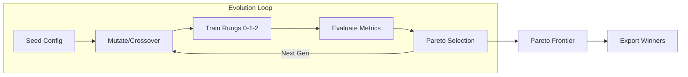

# Transformer Evolution LLM
[](https://deepwiki.com/strangeloopcanon/transformer-evolution-llm)

So what: this repo is a typed evolutionary search loop for language-model architectures, and it now has a practical bridge into upstream-style `train.py` research loops. TEVO explores motifs in a structured search space, exports them as `TrainRecipe` artifacts, and can project those motifs into upstream `autoresearch`-style CUDA `train.py` without hand-editing the file.

Current proof-of-concept: a projected TEVO-discovered frontier sibling improved upstream CUDA `autoresearch` from `val_bpb = 1.117953` to `1.113392` on the pinned upstream commit `c12eef778edafc89cd7ce036a7f500ddb5397a65`, while also reducing peak VRAM.

## What This Repo Is

Architectures are defined in typed YAML (Pydantic). The loop mutates and crosses over these specs, trains each candidate for a short budget, scores it on multiple objectives, and keeps a Pareto frontier. Children inherit weights from parents and crossover merges checkpoints when possible.

The point is not just to search for good small models. The point is to discover **motifs** under cheap proxy budgets, then test whether those motifs survive in more concrete downstream training code.

## Current Proof

The repo now supports this loop end to end:

1. TEVO discovers a candidate under a short-budget benchmark.
2. The candidate is exported into a backend-neutral `TrainRecipe`.
3. Oversized recipes are projected into the upstream CUDA `autoresearch` size envelope while preserving the motif.
4. The projected recipe is rendered into upstream-style `train.py`.
5. The resulting `train.py` is benchmarked on the real 5-minute CUDA `autoresearch` loop.

The first clean proof of that loop is now in place:

| Probe | Result |
|-------|--------|
| Stock upstream CUDA `autoresearch` baseline | `val_bpb = 1.117953` |
| TEVO motif-transfer probe | `val_bpb = 1.113392` |
| Delta | `-0.004561` better |
| Peak VRAM | `43.96 GiB -> 35.89 GiB` |

That is the current shareable story: **TEVO found a motif, the bridge transferred it honestly, and upstream `autoresearch` improved.**

This is a single projected probe on a pinned upstream commit, so treat it as proof that motif transfer works, not as a broad leaderboard claim yet.

The small proof bundle behind that claim lives in [artifacts/motif_transfer_proof](artifacts/motif_transfer_proof/README.md).

## Start Here

- [docs/motif_transfer_demo.md](docs/motif_transfer_demo.md) for the clearest explanation of the current TEVO -> `autoresearch` result
- [artifacts/motif_transfer_proof](artifacts/motif_transfer_proof/README.md) for the compact artifact bundle behind the current proof
- [docs/train_recipe_bridge.md](docs/train_recipe_bridge.md) for the bridge design and compatibility rules
- [docs/cuda_transfer_demo.md](docs/cuda_transfer_demo.md) for the CUDA workflow on Modal
- [docs/configuration_guide.md](docs/configuration_guide.md) for search configs, objectives, and selection policies

## Why This Exists

This repo is a sandbox for answering: under a fixed training recipe and constraints, what architectural motifs survive?

- explore quality / speed / memory trade-offs without hand-authoring dozens of variants
- keep the search inspectable: every run emits a frontier, lineage, and checkpoints
- use small or short-budget runs as a fast feedback loop before spending larger GPU budgets downstream

## Installation

**Prerequisites:** Python 3.11+, a compatible accelerator (CUDA / MPS / CPU), and [`uv`](https://astral.sh/uv/).

```bash
git clone https://github.com/strangeloopcanon/transformer-evolution-llm.git
cd transformer-evolution-llm
make setup
source .venv/bin/activate
```

Optional: `export HF_TOKEN="..."` for Hugging Face dataset access, `export TOKENIZERS_PARALLELISM=false` to suppress tokenizer fork warnings.

## Quick Start

Run a smoke evolution loop (CPU, ~2 minutes):

```bash
export TOKENIZERS_PARALLELISM=false
RUN="runs/live_smoke_$(date +%Y%m%d_%H%M%S)"
mkdir -p "$RUN"

python scripts/run_live.py configs/live_smoke.yaml \
  --device cpu --generations 3 --steps 40 --eval-batches 2 --seed 0 \
  --out "$RUN/frontier.json" \
  --lineage-out "$RUN/frontier_lineage.json" \
  --state-out "$RUN/frontier.state.json" \
  --checkpoint-dir "$RUN/checkpoints" \
  --prune-checkpoints-to-frontier \
  2>&1 | tee "$RUN/live.log"

python scripts/report_motifs.py "$RUN/frontier.json" \
  --lineage "$RUN/frontier_lineage.json" --top 10
```

Then export a winner and rerun it:

```bash
CANDIDATE_ID="<paste_id_from_report>"
python scripts/export_seed.py "$RUN/frontier.json" \
  --id "$CANDIDATE_ID" --out-config configs/seed_winner.yaml
python scripts/run_live.py configs/seed_winner.yaml \
  --device cpu --generations 1 --steps 40 --eval-batches 2 --seed 0 \
  --out runs/replay/frontier.json
```

See [docs/configuration_guide.md](docs/configuration_guide.md) for longer sweep commands (MPS, CUDA, Modal).

## What You Get From A Run

Each run writes artifacts under `runs/<run_id>/`:

| File | Purpose |
|------|---------|
| `frontier.json` | Non-dominated candidates (spec + metrics + id) |
| `frontier_lineage.json` | Genealogy graph (parents, mutations, crossover reports) |
| `frontier.manifest.json` | Run recipe + environment snapshot |
| `checkpoints/` | Model checkpoints (often pruned to frontier-only) |
| `live.log` | Full run log |

<details>
<summary><strong>System Architecture</strong></summary>



| Component | What it does |
|-----------|-------------|
| **DSL** (`dsl.py`) | Typed architecture genome (blocks, layers, mixers, training hparams) |
| **Orchestrator** (`orchestrator.py`) | Population management, selection (`map_elites`, `lexicase`, etc.) |
| **Mutations** (`mutations.py`) | Genetic operators that modify specs (grow, shrink, toggle) |
| **Crossover** (`crossover.py`) | Splice two architectures + merge checkpoints |
| **Evaluation** (`evaluation.py`) | Runged filtering: static analysis, short training, full training |
</details>

<details>
<summary><strong>Project Structure</strong></summary>

```
configs/                          YAML experiment configurations
docs/                             Deep-dive documentation
scripts/
    run_live.py                   Main entry point for evolution
    export_seed.py                Export a winner as a new seed
    report_motifs.py              Motif analysis
    run_benchmark.py              NanoGPT-style benchmark
    archive_run.py                Archive runs and reclaim disk
src/transformer_evolution_llm/
    dsl.py                        Architecture specification (Pydantic)
    models.py                     PyTorch block implementations
    orchestrator.py               Evolution engine
    trainer.py                    Training loop with weight inheritance
    mutations.py                  Genetic operators
    crossover.py                  Crossover + checkpoint merge
tests/                            Pytest suite
```
</details>

## Scope

- **Bounded search space:** evolution can only produce what the DSL + mutation set can express. To explore a new primitive, add it to the codebase first.
- **Short-budget proxies:** metrics come from short surrogate training. The frontier moves when you increase data, steps, or change objectives.
- **Not a leaderboard:** the NanoGPT-style benchmark is for repeatable *within-repo* comparisons.

<details>
<summary><strong>Full Documentation Index</strong></summary>

| Topic | Document |
|-------|----------|
| Configuration, objectives, selection profiles | [docs/configuration_guide.md](docs/configuration_guide.md) |
| Architecture comparison (GPT-2 vs nanochat vs TEVO), glossary | [docs/architecture_comparison.md](docs/architecture_comparison.md) |
| Current TEVO -> autoresearch motif-transfer proof | [docs/motif_transfer_demo.md](docs/motif_transfer_demo.md) |
| Example frontier survivors | [docs/example_frontiers.md](docs/example_frontiers.md) |
| Findings & operational lessons | [docs/evolution_takeaways.md](docs/evolution_takeaways.md) |
| Optimizer & method discovery | [docs/optimizer_method_discovery.md](docs/optimizer_method_discovery.md) |
| Run history & evolution log | [docs/run_history.md](docs/run_history.md) |
| Running on Modal GPUs | [docs/modal_run.md](docs/modal_run.md) |
| TrainRecipe bridge to autoresearch / MLX (including CUDA-safe motif projection) | [docs/train_recipe_bridge.md](docs/train_recipe_bridge.md) |
| First public CUDA transfer workflow | [docs/cuda_transfer_demo.md](docs/cuda_transfer_demo.md) |
| First public MLX transfer workflow | [docs/mlx_transfer_demo.md](docs/mlx_transfer_demo.md) |
| GPU scale-up plan (350M-1B) | [docs/gpu_run_plan.md](docs/gpu_run_plan.md) |
| NanoGPT-style benchmark contract | [docs/nanogpt_benchmark.md](docs/nanogpt_benchmark.md) |
| Scaling policies | [docs/scale_policy.md](docs/scale_policy.md) |
| nanochat alignment notes | [docs/nanochat_alignment.md](docs/nanochat_alignment.md) |
| CLI reference & workflows | [docs/cli_reference.md](docs/cli_reference.md) |
| Troubleshooting | [docs/troubleshooting.md](docs/troubleshooting.md) |
</details>

## Roadmap

1. **350M-1B sanity runs** on GPU -- validate that motifs discovered at small scale transfer. See [docs/gpu_run_plan.md](docs/gpu_run_plan.md).
2. **Speedrun-style eval** -- scale the packed-token cache and calibrate targets for useful dynamic range. See [docs/nanogpt_benchmark.md](docs/nanogpt_benchmark.md).
3. **Multi-GPU evolution** with ZeRO-1 or FSDP for larger populations.

## Contributing

We welcome contributions! See [AGENTS.md](AGENTS.md) for operational guidelines.

```bash
make setup       # Create venv + install deps
make check       # Format + lint + types + security
make test        # Run test suite
```
