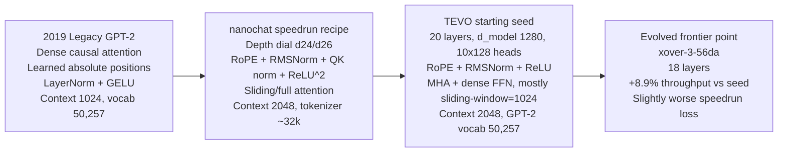

# Architecture Comparison

So what: this page is a historical architecture comparison snapshot for one nanochat-aligned TEVO run, plus a feature inventory of the DSL. It is useful background, but it is not the canonical statement of the repo's latest evidence.

## Legacy vs Speedrun vs TEVO Seed

These are three different model families. Comparing them directly is useful, but they are not interchangeable baselines.

| Axis | Legacy GPT-2 (2019) | nanochat speedrun recipe (current family) | TEVO starting seed (historical repo run) | Historical evolved frontier point (`xover-3-56da`) |
|---|---|---|---|---|
| Family | Original GPT-2 | nanochat GPT variant | TEVO DSL seed inspired by speedrun constraints | TEVO child from crossover lineage |
| Core stack | Dense causal attention + LayerNorm + GELU | RoPE + RMSNorm + QK norm + ReLU^2 + sliding/full pattern | RoPE + RMSNorm + ReLU + mostly sliding-window MHA | Same family as seed; no new primitive class added |
| Scale | Larger legacy GPT-2 variants (e.g., XL line) | Depth dial, GPT-2-grade around d24/d26 | d20 seed (`d_model=1280`, `10x128` heads) | d18 (`d_model=1280`, `10x128` heads) |
| Context | 1024 | 2048 | 2048 | 2048 |
| Vocab/tokenizer | GPT-2 tokenizer (`50,257`) | nanochat tokenizer (`~32k`) | GPT-2 tokenizer (`50,257`) | GPT-2 tokenizer (`50,257`) |
| Attention density | Fully dense | Mixed sliding/full by pattern | Mostly sliding-window (`1024`) with some full layers | Similar pattern, but one fewer sparse layer (`15 -> 14`) |
| Throughput (our run) | N/A | N/A | `2675.55 tok/s` | `2913.84 tok/s` (`+8.9%`) |
| Speedrun loss AUC (our run) | N/A | N/A | `9.5766` | `9.5952` (slightly worse) |
| Speedrun end eval loss (our run) | N/A | N/A | `9.3410` | `9.3607` (slightly worse) |
| What changed vs seed | N/A | N/A | Baseline for this run | `20 -> 18` layers, better efficiency/throughput trade-off point |

### Why we started from a different seed than nanochat `speedrun.sh`

- **Cost envelope for evolution loops:** we used the d20 branch (`~477M params`) instead of d26 (`~973M params`) so multiple generations are feasible on Modal A10G.
- **Tokenizer/data compatibility in this repo:** we ran with GPT-2 vocab (`50,257`) and packed FineWeb token IDs used by this code path, avoiding index mismatches in short-loop sweeps.
- **Goal of this run:** architecture search under TEVO's runged objectives, not a full reproduction of nanochat's end-to-end 8xH100 speedrun pipeline.
- **Reference parity still exists:** a d26 reference config is available here: `configs/ref_nanochat_speedrun_d26_aeff095e.yaml` (see [nanochat_alignment.md](nanochat_alignment.md)).

Exact seed used for the historical Modal evolution run discussed on this page:

- Seed architecture file: `configs/exp_nanochat_gpt2grade_d20_modal_evolve_fineweb_staggered_gpt2vocab_aeff095e.yaml`
- Original frontier path during that run: `runs/modal/modal_nanochat_fineweb_d20_staggered_a10g_g8_s140_seed0_20260206_160807/frontier.json` (historical local artifact, not part of the curated proof bundle)

## Feature Inventory

- **Typed DSL**: Architectures are defined in YAML/JSON using a strict Pydantic-based schema (`src/transformer_evolution_llm/dsl.py`), ensuring all generated candidates are valid by construction.
- **Embedding-Conditioned FFNs (optional)**: FFNs can read from the residual stream or directly from token embeddings; blocks can optionally include a secondary FFN branch to split capacity.
- **Aligned Crossover + Checkpoint Merge Reports**: Crossover aligns blocks by structural similarity and lineage IDs (`origin_id`/`parent_origin`), then merges checkpoints using that alignment with per-child transfer reports.
- **Archive Novelty + Multi-Objective Optimization**: Maintains a Pareto frontier and can score novelty via archive kNN sparseness (with parent-relative novelty kept as a diagnostic metric).
- **Rich Mutation Primitives (Grow + Shrink)**: Includes additive and simplifying operators (for example `remove_block_span`, `moe_to_dense`, `strip_extras`, `remove_recurrence`, `simplify_attention`) plus component/hyperparameter mutations.
- **Extensible Mutation Registry**: Built-ins, template mutations (`tpl::...`) and runtime plugin mutations can all be registered for autonomous selection and adaptive weighting.
- **Progressive Complexity Schedules**: Optional `gate_schedule` supports generation-based threshold ramps; MAP-Elites can optionally include complexity bands in archive keys.
- **Template Learning (experimental)**: Optionally adjusts and persists mutation templates based on which template mutations improve objectives (`evolution.template_learning`, `evolution.template_learning_save_path`).
- **Graph Module Primitive (experimental)**: A built-in `graph_module` component that can be inserted as a custom extra so search can explore small operator graphs, not just fixed blocks.
- **Audit Lineage**: Every discovery comes with a full lineage payload (`nodes`, mutation traces, crossover reports, novelty archive snapshot) plus visualization tools.
- **NanoGPT-style benchmark path (implemented)**: A repeatable speedrun-style metric (`tokens/time to target`) for comparing training efficiency inside this repo (see [nanogpt_benchmark.md](nanogpt_benchmark.md)).

## Glossary

### Core Terms

| Term | Definition |
|------|------------|
| **DSL** | Domain-Specific Language—the typed YAML/JSON schema for specifying architectures. See `dsl.py`. |
| **Rungs** | Tiered evaluation budgets. Rung 0 = static analysis (cheap), Rung 1 = short training, Rung 2 = full training. Candidates are promoted through rungs if they pass gates. |
| **Pareto Frontier** | The set of non-dominated solutions across multiple objectives. A candidate is on the frontier if no other candidate beats it on *all* objectives. |
| **Lamarckian Inheritance** | Children inherit trained weights from parents (not just the genome). This dramatically reduces compute since we don't train from scratch. |
| **Mutations** | Genetic operators that modify architecture specs: `dense_to_moe`, `add_recurrence`, `toggle_ssm`, etc. See `mutations.py`. |
| **Crossover** | Splicing two parent architectures to create a child with features from both. Includes intelligent weight merging. |

### Architecture Components

| Component | Description |
|-----------|-------------|
| **MoE (Mixture of Experts)** | FFN with multiple "expert" sub-networks; a router selects top-k experts per token. |
| **SSM (State Space Model)** | Mamba-style recurrent layers as an alternative to attention. |
| **MLA (Multi-head Latent Attention)** | Attention with compressed/latent KV projections (DeepSeek-style). |
| **Retro** | Retrieval-augmented memory that caches and retrieves past hidden states. |
| **Selectors** | Sparse attention variants that select a subset of tokens to attend to. |
