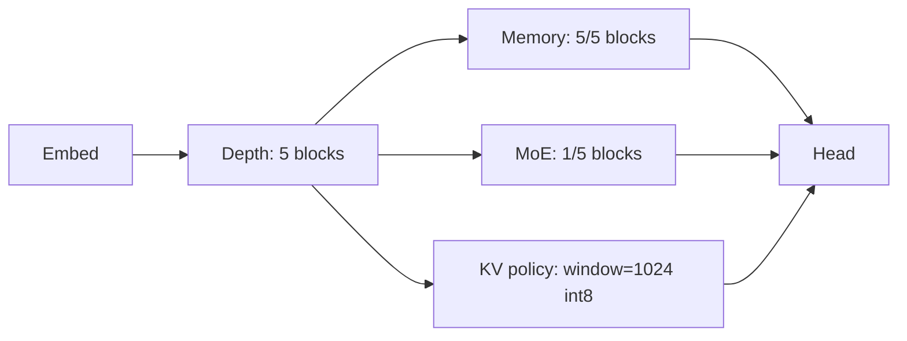
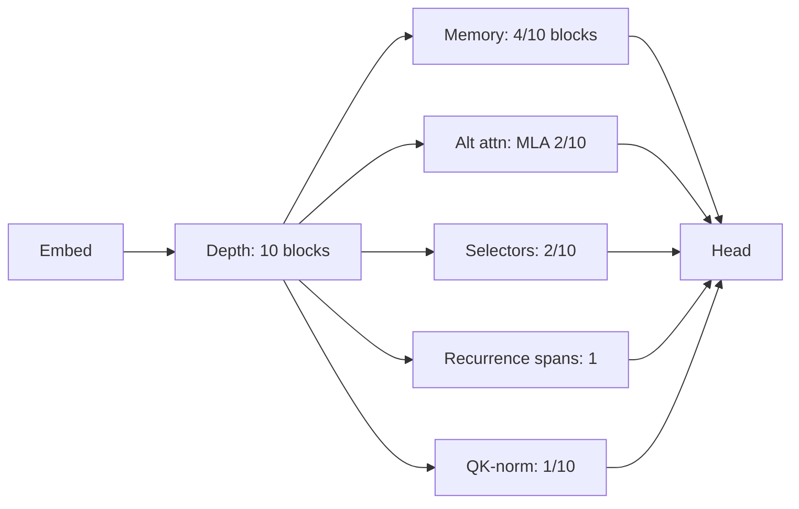
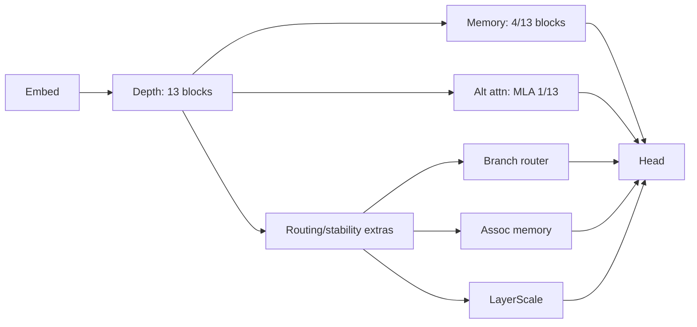

# Example Frontier Survivors

Illustrative survivors from evolution runs, showing the kinds of architectures the loop discovers.

## Long-Context Sweep (11-entry Pareto frontier, ~65-85M params)

Source (metrics + specs): `configs/frontiers/exp_longctx_full_deck_2h_m4_20251217_003818/frontier_arch.json` (generated from `configs/exp_longctx_overnight_m4_full_deck.yaml`).

### Quality-lean memory stack (best `ppl_code`)

Source: `configs/frontiers/exp_longctx_full_deck_2h_m4_20251217_003818/duplicate_block_span+toggle_kv_policy+add_extra_combo-292-4963.yaml`.
- Depth: 5 blocks; Memory blocks: 5/5; MoE blocks: 1/5; KV policy: `window=1024` + `int8`.
- Proxy metrics: `ppl_code≈121.45`, `passkey_loss≈7.79` (~83.4M params).



### Probe-lean hybrid (best `passkey_loss`)

Source: `configs/frontiers/exp_longctx_full_deck_2h_m4_20251217_003818/duplicate_block_span+toggle_qk_norm+add_extra_combo-91-10b3.yaml`.
- Depth: 10 blocks; Memory blocks: 4/10; Recurrences: 1; MLA blocks: 2/10; Selector blocks: 2/10; QK-norm blocks: 1/10.
- Proxy metrics: `passkey_loss≈5.43`, `ppl_code≈194.03` (~65.3M params).



### Deeper routed memory stack (balanced quality)

Source: `configs/frontiers/exp_longctx_full_deck_2h_m4_20251217_003818/insert_assoc_memory+tune_retro+tune_branch_router-375-1123.yaml`.
- Depth: 13 blocks; Memory blocks: 4/13; MLA blocks: 1/13; Extras: assoc-memory + branch-router + layer-scale.
- Proxy metrics: `ppl_code≈123.58`, `passkey_loss≈7.52` (~75.8M params).



## Behavioral Memory Sweep (Modal A10G, 64 generations)

Purely behavioral selection (loss + memory/speed + novelty/entropy) repeatedly discovered *embedding-conditioned FFNs* (FFNs that read token embeddings instead of the residual stream). This trait was not an explicit objective.

- Best `ppl_code`: `1331 -> 791`
- `long_recall`: `0.0 -> 1.175`
- `kv_bytes_per_token`: `8192 -> 7168`

Motif: early embedding-conditioned FFNs + mixed `MHA/GQA` attention + lightweight memory extras.

Repro:
```bash
TEVO_MODAL_GPU=A10G modal run scripts/modal_run_live.py \
  --config-path configs/exp_behavioral_memory_modal_v1.yaml \
  --generations 64 --steps 160 --eval-batches 4 --seed 0 \
  --download --local-out-dir runs/modal \
  --cleanup-old-checkpoints --prune-checkpoints-to-frontier --lineage
```
